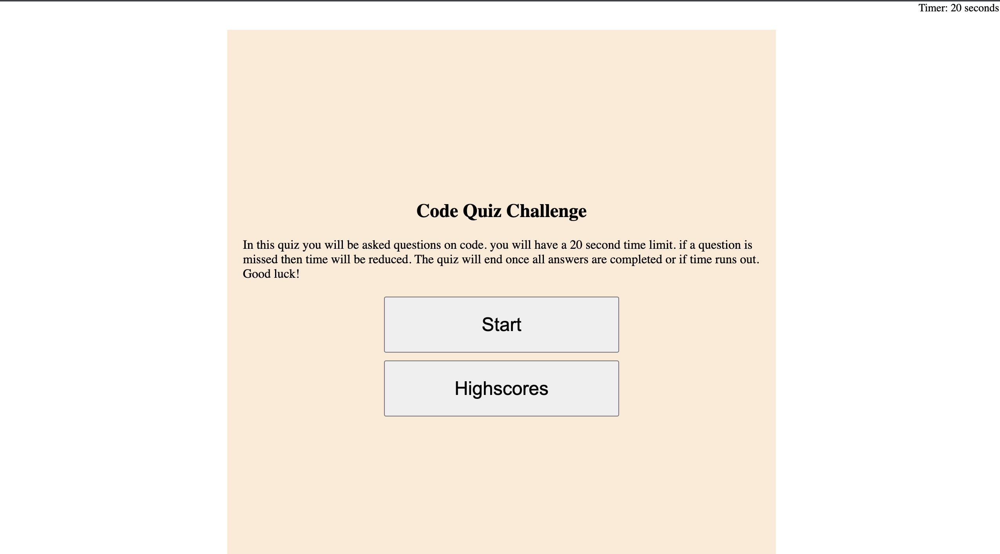

# Code-Quiz

## Summary

This project is quiz that the user can take where they will view a start page when the page is first opened. they will see a start button as well as a highscores button to be able to see highscores. once the quiz is started a series of questions will be asked and the user will respond by using buttons to pick the right answer. if correct answer is picked then the button they chose will be highlighted in green. if wrong answer is picked, the chosen button will be highlighted in red. 

once quiz is complete the user will be shown their score and and input box to input their initials. the page will then save their score into local storage and then be given the option to take the quiz again. 

This project uses a combination of:
* HTML
* CSS
* JavaScript

This project uses JavaScript features such as:

* arrays
* functions
* event Listeners
* if statements
* for loops

## Deployed page
https://davidpascual2.github.io/Code-Quiz-HW4/
## Repository Link
https://github.com/davidpascual2/Code-Quiz-HW4
## Preview

